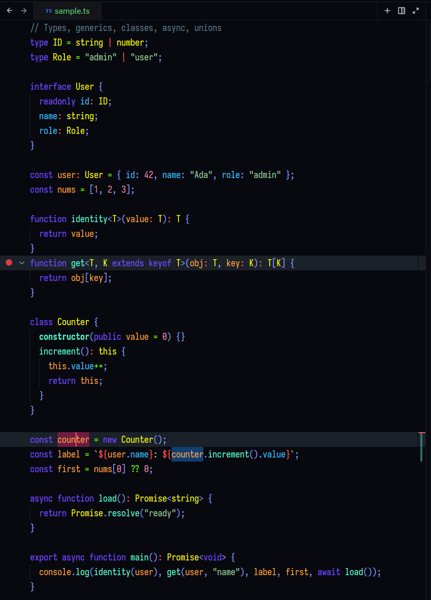

# Gafelson Lavender

A **Zed editor theme** — a dark theme blending the native **Gafelson** structure with **Dark Lavender** accents.



[View full size (850×1183)](https://github.com/devmor-j/gafelson-lavender-theme/blob/main/assets/theme-sample.png)

## Install

1. Open Zed **Settings** (`Ctrl/Cmd + ,`)
2. Go to **Themes**
3. Search for **Gafelson Lavender** and select it

Or from the command line:

```sh
zed extensions install gafelson-lavender-theme
```

## Development

Only `themes/gafelson-lavender.json` is edited — everything else is read-only input:

```
reference/          # source themes — READ ONLY
  dark-lavender-default.json    # VS Code Dark Lavender
  gafelson-dark-nomal.json      # Zed Gafelson
schema/             # official Zed theme schema — READ ONLY
themes/             # THE OUTPUT — the only place to edit
  gafelson-lavender.json
```

Rules:

- **Only edit** `themes/gafelson-lavender.json`.
- `reference/` and `schema/` are **read-only** — never change them.
- When choosing colors, prefer **Gafelson** (the native Zed theme) over Dark Lavender.

Validate the JSON:

```sh
python3 -c "import json; json.load(open('themes/gafelson-lavender.json')); print('ok')"
```

## License

MIT — see [LICENSE](LICENSE).
